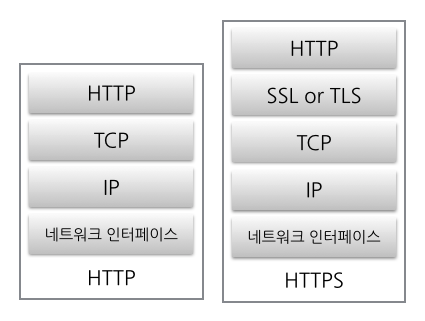

### HTTP란?

HTTP(Hyper Text Transfer Protocol)는 클라이언트와 서버 간의 이루어지는 요청/응답 프로토콜이고, html과 같은 리소스들을 가져올 수 있게 해준다.

#### 문제점

- **암호화 기능 없음**

  단순 text형식으로 주고받기 때문에, 중간에서 누군가가 신호를 가로챈다면 내용이 그대로 노출된다.

- **신뢰할 수 있는 사이트인지 확인 불가**

  통신하려는 사이트를 따로 확인하는 작업이 없어 다른 사이트가 통신하려는 사이트로 위장 가능

- **통신 내용 변경 가능**

  요청을 보낸 곳과 받은 곳의 리소스가 정확히 일치하는지 확인할 수 없다. 누군가가 중간에 데이터를 악의적으로 변조한다면 정확한 데이터를 주고받을 수 없게된다.

---

### HTTPS란?

HTTPS(Hyper Text Transfer Protocol Secure)는 기존의 http에 보안 기능을 강화한 것이다. https는 SSL을 이용하여 암호화, 증명서, 완전성 보호 기능을 제공한다. 따라서, http의 문제점을 보완할 수 있다.

 

**암호화 기능**

http 메세지를 암호화해서 보내준다. 데이터를 암호화해서 요청을 보내고, 받는 곳에서 복호화하여 메세지를 받는다. 따라서, 복호화를 하지 못하면 중간에 누군가 가로채어도 내용을 알아볼 수 없다. 암호화/복호화 방식에는 대칭키 방식과, 비대칭키 방식이 있다.

 

**인증 및 완전성 증명**

SSL(Secure Socket Layer)은 클라이언트와 서버간의 통신을 제 3자가 보증해주는 인증서를 제공한다. 클라이언트가 서버에 접속하면 서버는 클라이언트에게 인증서 정보를 제공한다. 클라이언트는 이 인증서 정보를 검증한 후에 다음 절차를 수행하기 때문에 신뢰성을 확인할 수 있다. 또한, SSL은 요청과 응답의 변조를 막기 위해 MD5, SHA-1과 같은 해시값을 확인하는 방법과 파일의 디지털 서명을 확인하는 방법을 사용한다. 따라서, 데이터의 완전성을 증명할 수 있다.

---

### SSL에서 사용하는 암호화 기법

SSL은 보안과 성능상의 이유로 **대칭키**와 **비대칭키** 암호화 방식을 사용하고 있다. 대칭키는 보안이 취약한 단점이 있지만 처리 속도가 빠르다는 장점이 있다. 하지만 비대칭키는 처리속도가 느리지만 보안이 강한 장점이 있다. 통신할 때마다 비대칭키를 이용하면 보안 문제가 해결될 수 있으나, 컴퓨터에 많은 부담을 준다. 따라서, 처음 SSL 인증서를 제공하여 검증하는 과정은 보안이 강한 비대칭키 방식을 사용하고, 이후에는 대칭키를 사용하여 컴퓨터에 부담을 덜어준다.