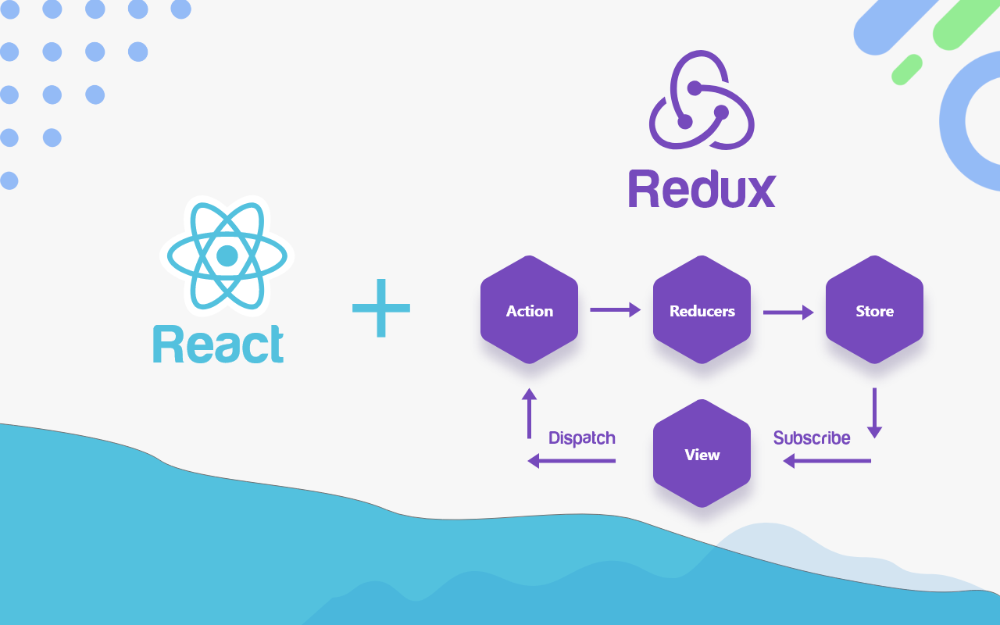

> http://dobbit.github.io/redux


### 개념

Vuex와 같은 중앙 집중형 저장소이다. 프로젝트의 규모가 크고 복잡해지면 컴포넌트의 상태(state)를 관리하기가 힘들다. 왜냐하면, 트리 구조이기때문에 멀리 있는 컴포넌트에 값을 전달하려면 상위 루트(공통 부모노드)까지 올라갔다가 가야한다.

Redux를 사용하면 중앙 저장소에서 값을 관리하기때문에 아무 컴포넌트에서나 접근할 수 있다. 따라서, 컴포넌트의 상태를 단순하게 처리할 수 있다. 또한, 반복되는 작업을 store에 저장해놓고 처리할 수 있어 코드의 재사용 측면에서도 장점이 있다.


### 동작

```
src
├── actions
│		└── index.js
│		└──	login.js
├── store
│	└──	index.js
└── reducers
    └── index.js
    └──	user.js
```

1. Component에서 Dispatch 실행

   ```javascript
   store.dispatch(ACTION); // 스토어값 변경
   store.getState(); // store 값 반환
   ```

2. Action에 정의된 형식을 이용하여 reducer 호출

   ```javascript
   export const LOGIN = 'LOGIN';
   
   export function login(user) {
       return {
           type: LOGIN,
           user: user,
       }
   };
   ```

3. reducer에서 state를 변경해서 store의 state 최신화

   - reducer/user.js

   ```javascript
   import {LOGIN} from '../action/user';
   
   const initialState = {
     user: null,
   };
   
   function userReducer(state = initialState, action) {
     switch (action.type) {
       case LOGIN:
         const newState = Object.assign({}, state, {user: action.user});
         return newState;
   
       default:
         return state;
     }
   }
   
   export default userReducer;
   
   ```

   - store/index.js

   ```javascript
   import { createStore, applyMiddleware } from 'redux';
   import reducers from '../reducer/index';
   import { composeWithDevTools, devToolsEnhancer } from 'redux-devtools-extension';
   import ReduxThunk from 'redux-thunk';
   
   export const store = createStore(
       reducers,
       // no middleware
       // devToolsEnhancer(
       //     reducers
       // )
   
       // use middleware
       composeWithDevTools(
           applyMiddleware(ReduxThunk),
       )
   );
   ```

4. subscribe로 state의 값이 변경된 것을 감지하여 반영

   ```javascript
   store.subscribe(LISTENER)
   ```

   


### 동작 (react-redux 사용)

>  subscribe를 사용하지 않아도 state의 값이 변경 되면 다시 받아올 수 있음

```react
const mapDispatchToProps = (dispatch) => ({
  login: (user) => dispatch(login(user)),
});

const mapStateToProps = (state) => ({
  user: state.userReducer.user,
});

class Login extends Component {
	constructor(props) {
        super(props);
    };
    onLogin = () => {
        this.props.login(data); // 로그인 디스패치
        this.props.user.data; // 유저 정보 반환
    };
    render() {
        return (
        	...
        )
    }
};

export default connect(mapStateToProps, mapDispatchToProps)(Login);
```

...이하 동일


### 구조

**Store**

앱의 모든 상태를 트리 구조로 저장

```
import { createStore } from 'redux';
import reducers from '../reducer/index';

export const store = createStore(reducers);
```

 

**Action**

state를 어떻게 바꿔줄지 형식을 정의

dispath를 수행하면 action에 있는 함수를 리턴받아서 reducer를 실행 시킴

```javascript
export const LOGIN = 'LOGIN';

export function login(user) {
    console.log('action: ', user)
    return {
        type: LOGIN,
        user: user,
    }
};
```

 

**Reducer**

store에 있는 state를 action에 정의된 형식을 이용하여 만들어줌

```javascript
import { LOGIN } from '../action/user';

const initialState = {
    user: null,
};

function userReducer(state=initialState, action) {
    console.log('reducer: ', action);
    switch(action.type) {
        case LOGIN:
            console.log('reducer complete');
            return Object.assign({}, state, {user: action.user} )

        default:
            console.log('default')
            return state
    }
};

export default userReducer;
import { combineReducers } from 'redux';
import userReducer from './user';

const reducers = combineReducers({
    userReducer,
});

export default reducers;
```

 

**Container**

Component를 담고 있다. Component는 부품으로 재활용할 수 있도록 본래의 역할만을 수행시키는 것이 좋다. 따라서, Component를 감싸고, redux를 이용하는 부분을 container로 빼줌으로써 종속성을 제거할 수 있다. 

 

**middleware**

- state를 변경하기 위해 비동기 처리가 필요한 경우 사용

- action과 reducer 사이에 위치

- thunk와 sage 라이브러리 사용


---

### 오류

**문제**

> dispatch not working

아래와 같이 connect에 인자로 넣어주면 사용자가 직접 정의하여 쓸 수 있다. 하지만 내 경우엔 login(user)로 action에 정의된 함수만 리턴받고, dispatch는 실행되지 않았다.

```javascript
const mapDispatchToProps = (dispatch) => ({
  login: (user) => dispatch(login(user)),
})

export default connect(mapDispatchToProps)(Login);
```

 **해결방법**

다음과 같이 매개변수를 지우고 직접 store에 있는 reducer를 쓰는 createStore를 호출함으로써 해결했다.

```
store.login(userData);
```

- react-redux

```javascript
this.props.login(userData);
```