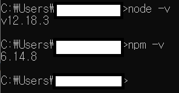
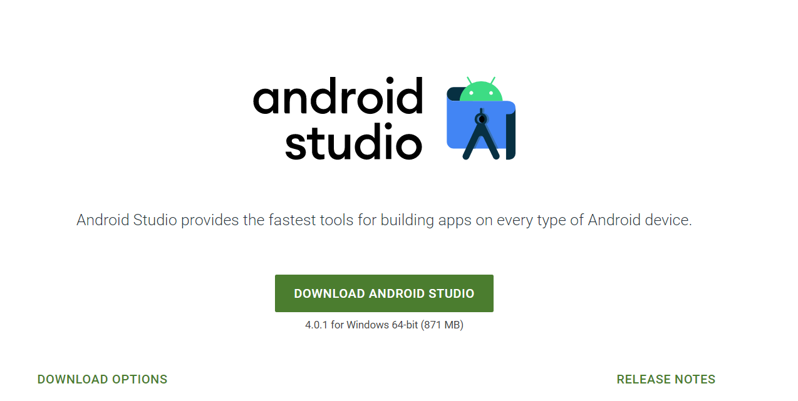

### Node.js 설치

> https://nodejs.org/ko/

LTS 버전으로 설치 (안정성)

node.js를 설치하면 npm도 함께 설치되고, 환경 변수까지 추가되므로 따로 수정할 필요 없다.




### Android Studio

> https://developer.android.com/studio?hl=ko

1. 위 사이트에 접속하여 설치 진행

   

2. SDK 설치

   1. 안드로이드 스튜디오의 오른쪽 카테고리에서 SDK Manager 클릭
   2. show package details 체크
   3. 사용할 android 버전에서 필요한 sdk 설치
      - sdk tools
        - android sdk build-tools
        - android emulator
        - android sdk platform-tools
        - google play licensing library
        - intel x86 emulator accelerator (HAXM installer)
      - sdk platforms
        - Android SDK Platform 29
        - Sources for Android 29
        - Intel x86 Atom System Image
        - Google APIs Intel x86 Atom System Image
        - Google APIs Intel x86 Atom_64 System Image

3. 환경 변수 설정

   - 사용자 변수
     - ANDROID_HOME

       sdk manager에 있는 경로 (~/~/SDK)

     - path 추가

       위에 추가한 경로/platform-tools

   - 시스템 변수
     
  - C:\Program Files\Android\Android Studio\jre\bin
   

   
   

### react native cli 설치

```bash
npm install -g react-native-cli # 설치

react-native init 프로젝트명 # 프로젝트 생성
```

- bash에서 npm 설치가 안될 경우, cmd를 사용


### 실행

1. 안드로이드 스튜디오 실행
2. 프로텍트 > android를 선택
3. tools => AVD Manager 선택
   - sdk를 설치한 버전에 맞는 가상 디바이스를 만든 후 실행 (두 번째부터는 Cold Boot로 실행)

4. 가상 디바이스가 완전히 켜지면 프로젝트 안에서 bash를 염
   - react-native run-android 입력


### jdk14 이상을 사용할 경우

> /android/gradle/wrapper/gradle-wrapper.properties

gradle의 버전을 6.3 이상으로 설정해야 함

```properties
# from
distributionUrl=https\://services.gradle.org/distributions/gradle-6.2-all.zip

# to
distributionUrl=https\://services.gradle.org/distributions/gradle-6.3-all.zip
```

