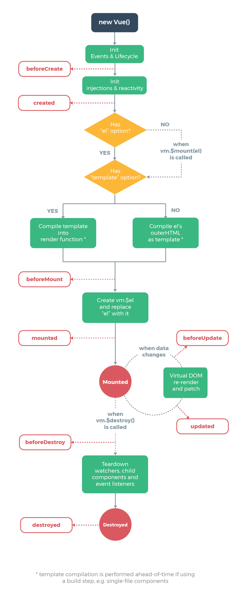
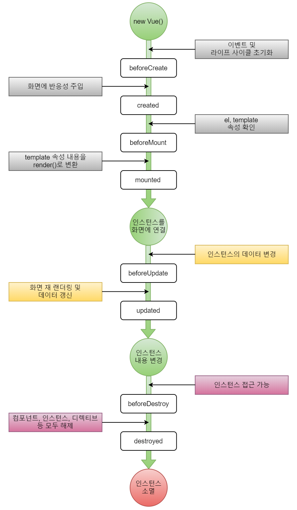
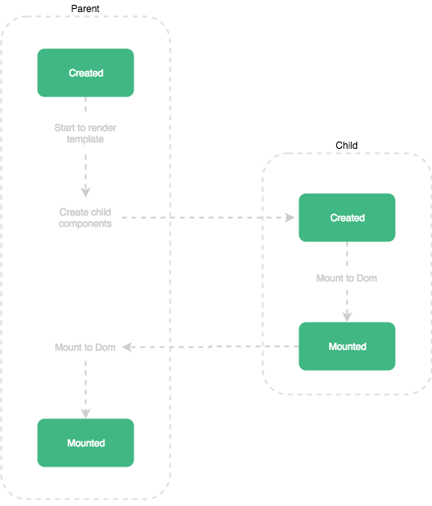

# Life Cycle

### 종류

1. Create
2. Mount
3. Update
4. Destruct

### Create

> 컴포넌트 초기화 단계

- <u>아직 컴포넌트가 돔에 추가되기 전,</u> 실행되는 훅입니다.

- `DOM`에 접근 불가

- `this.$el` 사용 할 수 없음

- `클라이언트`와 `서버`단 렌더링 모두에서 처리해야 할 일이 있다면, 이 단계에서 사용
- 분류

  - beforeCreate

    라이프 사이클에서 가장 먼저 실행되는 훅입니다.  `data`와 `event`, `감시자` 등이 설정되 기 전 상태입니다.

  - created

    `data`와 `event`가 활성화 되있어서 사용할 수 있습니다. 하지만, 템플릿과 가상돔은 마운트 되기 전 상태이므로 `this.$el`을 사용할 수 없습니다.

### Mount

> 돔(DOM) 삽입 단계

- <u>컴포넌트가 DOM에 추가될 때</u>, 실행되는 훅입니다.

- 서버단 렌더링을 지원하지 않습니다.

- 초기 렌더링 직전에 DOM 변경을 원한다면 이 훅을 사용합니다. 컴포넌트 초기에 세팅해야하는 데이터는 `created` 훅을, 렌더링 이후 DOM을 변경해야 한다면 `mounted` 훅을 사용하는 것이 좋습니다.

- 분류

  - beforeMount

    컴포넌트가 DOM에 추가되기 직전에 실행되는 훅입니다. created와 mounted를 사용하면 되기 때문에 거의 사용하지 않는 훅입니다.

  - mounted

    컴포넌트가 DOM에 추가 된 후 호출되는 훅입니다. `$el` 을 사용하여 DOM에 접근 할 수 있습니다. 자식 컴포넌트가 모두 `DOM`에 추가된 후, 부모 컴포넌트의 마운트가 끝나기 때문에 모든 컴포넌트가 마운트 됐다고 보장할 수 없습니다.
    
    

### Update

>  변경 및 재 렌더링 단계

- 컴포넌트에서 사용되는 <u>반응형 속성들이 변경되거나 컴포넌트가 재 렌더링되면</u> 실행되는 훅입니다.

- `디버깅`이나 `프로파일링` 등을 위해 컴포넌트 재 렌더링 시점을 알고 싶을 때 사용합니다.

- 재 렌더링 될 때, 변경된 값으로 어떤 작업을 해야한다면 이 훅을 사용합니다.

- 분류

  - beforeUpdate

    돔이 재 렌더링 되고 패치되기 직전에 호출합니다. 업데이트 된 값을 가지고 있기 때문에 다른 값으로 업데이트 가능합니다. 값이 변경되더라도 beforeUpdate 훅이 호출되지 않으므로 무한루프에 빠지지 않습니다.

  - updated

    DOM이 재 렌더링 된 후 호출되는 훅입니다. DOM이 업데이트 된 후에 호출되기 때문에 변경된 후의 DOM을 이용해야하는 경우 유용합니다. 단, 여기서 데이터를 변경하면 update 훅이 호출되므로 무한 루프에 빠질 수 있습니다.

### Destroy

> 해체 단계

- <u>컴포넌트가 제거 될 때</u>, 실행되는 훅입니다.

- 분류

  - beforeDestroy

    컴포넌트가 제거되기 직전에 호출되는 훅입니다. 아직 컴포넌트가 본래의 기능을 가지고 있는 상태입니다. `이벤트 리스너`, 컴포넌트에서 `동적으로 할당 받은 자원`을 해제 할 때 사용합니다.

  - destroyed

    컴포넌트가 제거된 후 호출되는 훅입니다. 컴포넌트의 모든 `이벤트 리스너`와 `디렉티브의 바인딩`이 해제되고, `하위 컴포넌트`도 모두 제거됩니다.

#### 참고

> - https://medium.com/witinweb/vue-js-%EB%9D%BC%EC%9D%B4%ED%94%84%EC%82%AC%EC%9D%B4%ED%81%B4-%EC%9D%B4%ED%95%B4%ED%95%98%EA%B8%B0-7780cdd97dd4
> - https://beomy.tistory.com/47

