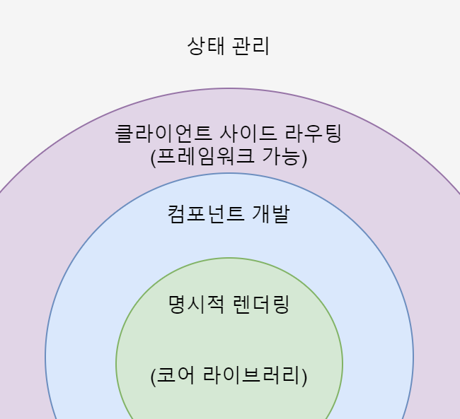
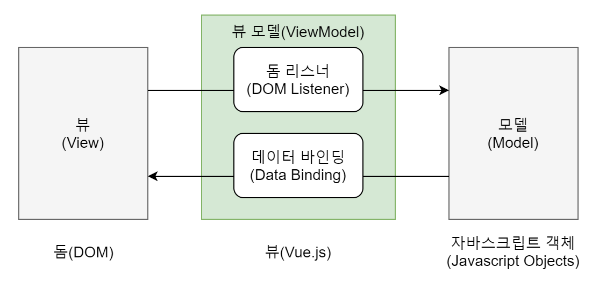
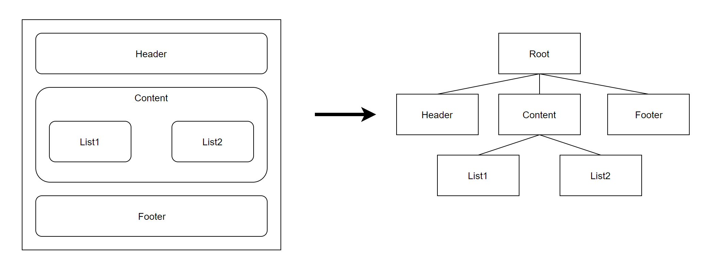

### Vue.js 란?

웹 페이지 화면을 개발하기 위한 **Front-end Framework**로, 초보자들도 <u>쉽게 사용</u>할 수 있도록 만들어졌습니다.

Vue 코어 라이브러리는 `화면단 데이터 표현`에 관한 기능들을 중점적으로 지원합니다. 하지만, 프레임워크의 기능인 `라우터`, `상태 관리`, `테스팅` 등을 쉽게 결합할 수 있는 형태로 제공됩니다.

Vue는 라이브러리의 역할뿐만 아니라 프레임워크의 역할도 할 수 있기 때문에 **점진적인 프레임워크**라고 표현합니다.

### 장점

##### 배우기 쉽습니다

HTML, CSS, JavaScript의 기초만 아는 초보자도 하루만에 배울 수 있습니다.

##### React나 Angular에 비해 성능이 우수할 뿐만 아니라 가볍고 빠릅니다.

##### React와 Angular의 장점을 모두 갖고 있습니다.

Vue는 Angular를 가볍게 사용하기 위해 만들어졌습니다. 또한, Angular의 `데이터 바인딩` 특성(양방향 데이터 바인딩)과 React의 `가상 돔` 기반 렌더링 특징을 결합한 것입니다.

가상 돔을 활용하면 특정 돔 요소를 추가나 삭제 등의 변경이 생기면, 화면 전체를 다시 그리지 않고 프레임워크에서 정의한 방식에 따라 화면을 바꿉니다.

### 특징

##### UI 화면만 라이브러리

Vue는 `MVVM` 패턴의 **ViewModel**에 해당하는 화면단 라이브러리입니다.

###### ※MVVM 패턴이란?

`Front-end`의 화면 동작 관련 로직과 `Back-end`의 데이터베이스 처리 로직을 <u>분리</u>하여 개발하는 소프트웨어 디자인 패턴입니다. 따라서, 코드를 더 직관적으로 볼 수 있고, 유지보수가 편하다는 장점이 있습니다.

###### ※용어 설명

- View:  사용자에게 보이는 화면
- DOM: HTML 문서에 들어가는 요소(태그, 클래스, 속성)의 정보를 담고 있는 데이터 트리
- DOM Listener: 돔의 변경 내역에 대해 즉각적으로 반응하여 특정 로직을 수행하는 장치
- Model: 데이터를 담는 용기, 보통은 서버에서 가져온 데이터를 자바스크립트 객체 형태로 저장
- Data Binding: View에 표시되는 내용과 모델의 데이터를 동기화
- ViewModel: View와 Model의 중간 영역으로, DOM Listener와 Data Binding을 제공하는 영역

##### 컴포넌트 기반의 프레임워크

여러 컴포넌트들을 조합해서 화면을 구성합니다. 따라서, 코드를 재사용하기 쉽습니다. 

#### Reference

> http://wiki.plateer.com/pages/viewpage.action?pageId=8552708