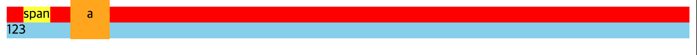

# Display 속성

### 블록

##### 특징

- 라인 전체 차지
- `width`, `height` :  지정 가능
- `margin`, `padding` : 상, 하, 좌, 우 


### 인라인

#####  특징

- 컨텐츠 크기만큼 차지
- `width`, `height` : 지정 할 수 없음
- `margin`, `padding` : 좌, 우 (상,하는 공간이 있어서 배경색을 입히면 먹지만 다른 요소의 영향 x)

##### 예제

```html
<div class="box">
  <span>span</span>
  <a>a</a>
</div>
<div class="box2">123</div>
```

```css
.box {
    background-color: red;
    margin-top: 150px;
}
.box > span {
    background-color: yellow;
    margin: 20px;

}
.box > a {
    /* display: inline-block; */
    background-color: orange;
    padding: 20px;
}
.box2 {
    background-color: skyblue;
}
```

##### 사진




### 인라인 블록

- 컨텐츠 크기만큼 차지 (인라인)
- `width`, `height` : 가능 (블록)
- `margin`, `padding` : 상, 하, 좌, 우 (블록)

